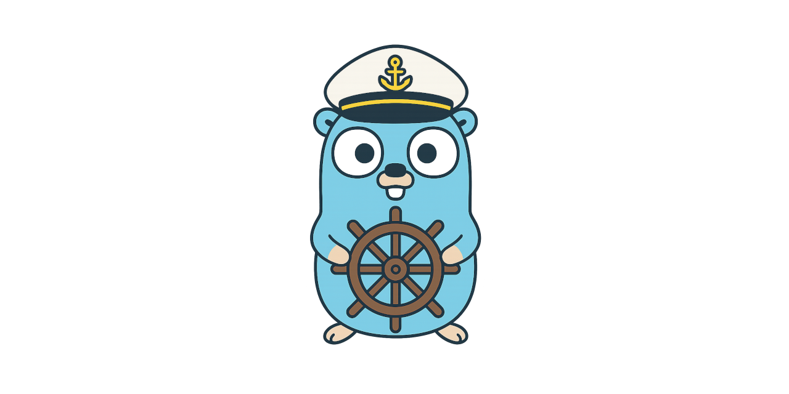

# Captain Compose

**Captain Compose** is a lightweight deployment agent that listens for deployment instructions (e.g. via MQTT) and applies docker-compose.yaml files using the Docker engine.



## 📦 What Is It?

Captain Compose runs as a small background agent that listens for deployment instructions — currently via **MQTT** — and applies `docker-compose` workloads dynamically.

It is designed for **distributed systems**, **edge environments**, or **air-gapped nodes** that need to receive and execute deployment tasks remotely.

## ✨ Features

- 🛠 Runs `docker-compose` deployments on command
- 📡 Listens for deployments over MQTT
- 📤 Publishes status events (e.g. success/failure)
- 🔒 Supports TLS for secure brokers
- 📂 Logs to both stdout and file (via `slog`)
- 🚀 Precompiled binary available (see below)

## 🧪 MQTT Edition

The first binary edition is `captain-compose-mqtt`, which listens to MQTT topics for commands like:

- `create` → apply a docker-compose deployment
- `remove` → tear it down

## 🧰 Quick Start

### 1. Download the Binary

Precompiled binaries will be available soon via [Releases](https://github.com/your-org/captain-compose/releases).  
For now, you can build it manually:

```bash
go build -o captain-compose-mqtt ./cmd/captain-compose-mqtt
```

### 2. Configure

Copy the example config and adjust it to your environment:

```bash
cp config/mqtt/config.example.yaml config/mqtt/config.yaml
```

Edit the values as needed:

```yaml
listener_topic: "captain-compose/commands"
publisher_topic: "captain-compose/events"

mqtt:
  broker_url: "tcp://localhost:1883"
  client_id: "captain-compose"
  username: ""
  password: ""

  tls:
    enable: false
    ca_cert_path: ""
    client_cert_path: ""
    client_key_path: ""
    insecure_skip_verify: false

log:
  level: "info"
  format: "text"
  file_path: "./captain-compose.log"
```

### 3. Run

```bash
./captain-compose-mqtt
```

By default, it loads config from `config.yaml`.

## 🔁 MQTT Payload Format

### Create a deployment

```json
{
  "type": "create",
  "data": {
    "name": "nginx-demo",
    "payload": "BASE64_ENCODED_DOCKER_COMPOSE_FILE"
  }
}
```

### Remove a deployment

```json
{
  "type": "remove",
  "data": {
    "name": "nginx-demo"
  }
}
```

## 🧩 Want to Add Other Input Sources?

This repository is modular. If you'd like to add another edition (like `captain-compose-http` or `captain-compose-fs`), feel free to:

- Open an issue to discuss your idea
- Fork and contribute it as a clean binary under `cmd/`
- Follow the same structure as the MQTT version

Let’s make `docker-compose` a controllable workload in any environment.

## 🤝 Contributing

Feedback, ideas, and contributions are welcome!

- File an issue
- Create a pull request
- Discuss an integration
