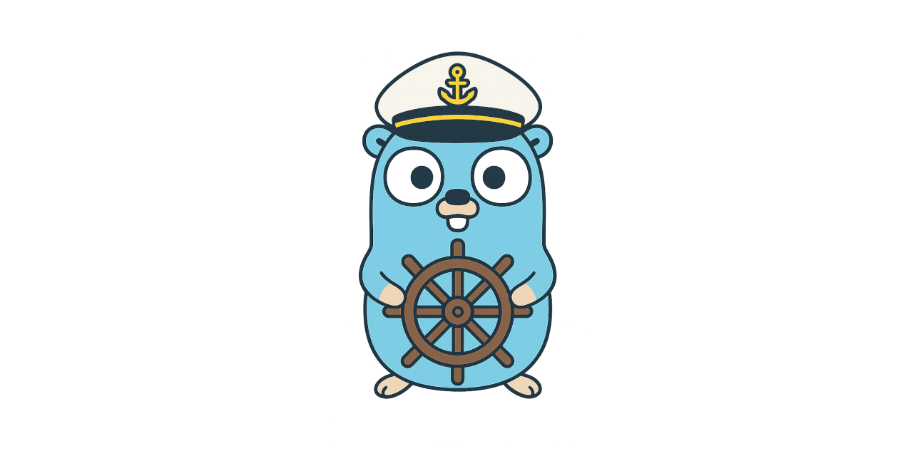

# Captain Compose

[](https://github.com/Glacius-Labs/Captain-Compose/actions/workflows/ci.yml)
[](LICENSE)

Captain Compose is a small Go agent that receives MQTT commands and manages
long-running Docker Compose workloads on a single host. It is designed for trusted
operators managing edge nodes and distributed installations.



## What it does

- Creates and updates image-based Compose deployments; waits for running/healthy services.
- Removes managed workloads while preserving their volumes.
- Persists commands, Compose manifests and results across process restarts.
- Deduplicates request IDs for seven days and retries undelivered status events.
- Reconnects and resubscribes to MQTT with TLS, optional mutual TLS and per-node topics.
- Ships as native binaries for Linux, macOS and Windows, with a Linux service installer.

MQTT publishers are trusted host administrators: Compose can access the Docker host.
This is not a container sandbox, a cloud provisioner, or an exactly-once job runner.
See the [security model](docs/security.md) and [delivery guarantees](docs/architecture.md).

## Quick start from source

Requirements: the Go version in [go.mod](go.mod), Docker with Compose v2.20+,
and a reachable MQTT 3.1.1 broker. Production targets Linux; Windows/macOS development
uses Docker Desktop's Linux engine.

```bash
go build -o bin/captain-compose-mqtt ./cmd/captain-compose-mqtt
cp config/mqtt/config.example.yaml config.yaml
docker compose -p captain-compose-dev -f docker/mosquitto/docker-compose.yml up -d
./bin/captain-compose-mqtt --config config.yaml --check
./bin/captain-compose-mqtt --config config.yaml
```

On PowerShell, use `Copy-Item` and build `bin/captain-compose-mqtt.exe`. The example
broker binds only to localhost and permits anonymous connections for development.
Production requires authenticated TLS and topic ACLs.

In another terminal, subscribe to `captain-compose/dev-node/events` with QoS 1.
Create `compose.yaml`:

```yaml
services:
  web:
    image: nginx:1.28-alpine
    ports:
      - "127.0.0.1:8080:80"
    healthcheck:
      test: ["CMD", "wget", "-q", "-O", "/dev/null", "http://127.0.0.1/"]
      interval: 5s
      timeout: 3s
      retries: 10
```

Publish a non-retained QoS 1 request to `captain-compose/dev-node/commands`:

```json
{
  "id": "673fca08-5e71-45f9-bfe3-4cb9b79c4731",
  "type": "create",
  "data": {
    "name": "web",
    "payload": "BASE64_ENCODED_COMPOSE_YAML"
  }
}
```

The [protocol guide](docs/protocol.md) includes a runnable encoder/publisher example,
removal commands, event schemas and migration instructions. Assign a new UUID to each
intended operation and preserve it when retrying uncertain delivery.

## Install and provision

Use [Captain Compose 1.0.0](https://github.com/Glacius-Labs/Captain-Compose/releases/tag/v1.0.0)
or a newer stable version from GitHub Releases.
Archives include the binary, documentation, example config, license and installers.
The release pipeline produces checksums and build attestations.

```bash
bash scripts/install.sh --version 1.0.0 --prefix "$HOME/.local/bin"
bash scripts/provision.sh --config ./production.yaml --dry-run
```

For systemd, install to `/usr/local/bin`
and follow the [operations guide](docs/operations.md) to configure secrets, service
ownership and startup. The installer supports offline archives and verifies SHA-256
before replacing the executable. Provisioning preserves existing configuration and
starts the service only when `--start` is supplied.

## Verify and contribute

```bash
go test -race ./...
go vet ./...
CAPTAIN_INTEGRATION=1 go test -race -tags=integration -timeout=5m ./...
```

Integration tests create and clean up their own Docker resources. GitHub CI runs
unit/race tests on three operating systems, real Docker/MQTT integration tests,
dependency vulnerability checks, installer checks and release packaging smoke tests.
Version tags on main produce a tested, attested **draft** release for maintainer review.

- [Architecture and guarantees](docs/architecture.md)
- [MQTT protocol and migration](docs/protocol.md)
- [Installation, upgrades and recovery](docs/operations.md)
- [Security](docs/security.md)
- [Readiness evidence](docs/production-readiness.md)
- [Problems, decisions and ideas](docs/problems-and-ideas.md)
- [Contributing and releases](CONTRIBUTING.md)
- [Changelog](CHANGELOG.md)

Licensed under [Apache-2.0](LICENSE).
